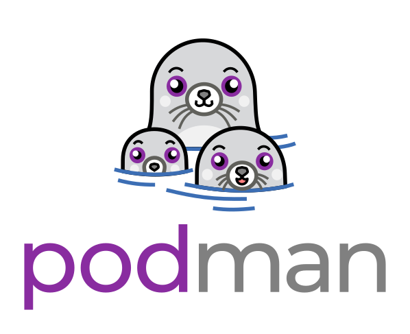

# Table of Contents
1. [Introduction](#introduction)
2. [Podman ka Detailed Explanation](#detailed-explanation-of-podman)
   - [Rootless Containers](#rootless-containers)
   - [Daemonless Architecture](#daemonless-architecture)
   - [OCI Standards ke saath Compatibility](#compatibility-with-oci-standards)
   - [Commonly Used Podman Commands](#podman-commands)
   - [Podman Pods](#podman-pods)
   - [Systemd ke saath Integration](#integration-with-systemd)
   - [Security Features](#security-features)
   - [Conclusion](#conclusion)
3. [Installation](#installation)
   - [Linux par](#on-linux)
4. [Podman Commands](#podman-commands) 

# Introduction
Podman (Pod Manager) ek tool hai jo containers aur pods ko manage karne ke liye use hota hai. Ye libpod library ka hissa hai aur Docker jaisa command-line interface provide karta hai. Podman aapko containers create, manage, aur run karne ki suvidha deta hai bina kisi daemon ki zarurat ke, jo ise Docker se zyada secure aur lightweight alternative banata hai.

# Podman ka Detailed Explanation

Podman ek container management tool hai jo containers aur images ko manage karne ke liye command-line interface provide karta hai. Ye Docker ka drop-in replacement{ek component hai jo kisi doosre component ko replace karne ke liye istemal kiya ja sakta hai bina kisi code ya configuration ko badle} banne ke liye design kiya gaya hai, jo similar functionality offer karta hai lekin kuch key differences ke saath. Yaha Podman ka detailed explanation diya gaya hai:

### Rootless Containers
Podman ki ek standout feature hai ki ye containers ko non-root user ke roop mein run kar sakta hai, jise rootless containers bhi kaha jata hai. Ye security enhance karta hai privilege escalation attacks ke risk ko kam karke. Rootless containers user namespaces ke saath run hote hain, jo users ko containers create aur manage karne ki suvidha dete hain bina root privileges ki zarurat ke.

### Daemonless Architecture
Docker ke unlike, jo containers ko manage karne ke liye ek central daemon par rely karta hai, Podman daemonless architecture mein operate karta hai. Har container Podman command ka child process hota hai jo ise start karta hai. Iska matlab hai ki koi single point of failure nahi hai, aur users containers ko manage kar sakte hain bina kisi constantly running background service ki zarurat ke.

### Podman Commands
Podman containers, images, pods, aur volumes ko manage karne ke liye ek comprehensive set of commands offer karta hai. Kuch key commands hain:
- `podman run`: Ek image se container create aur start karta hai.
- `podman build`: Containerfile se instructions ka use karke ek image build karta hai.
- `podman push`: Ek image ko container registry mein push karta hai.
- `podman pull`: Ek image ko container registry se pull karta hai.
- `podman ps`: Running containers ko list karta hai.
- `podman stop`: Ek ya zyada running containers ko stop karta hai.
- `podman rm`: Ek ya zyada stopped containers ko remove karta hai.
- `podman rmi`: Local storage se ek ya zyada images ko remove karta hai.

### Podman Pods
Podman pods ka concept introduce karta hai, jo ek ya zyada containers ka group hota hai jo same network namespace share karte hain. Ye Kubernetes ke pod concept jaisa hai. Pods better resource sharing aur related containers ke management ki suvidha dete hain. `podman pod` command group various subcommands provide karta hai pods ko create, manage, aur inspect karne ke liye.

### Systemd ke saath Integration
Podman containers aur pods ke liye **systemd unit files** generate kar sakta hai, jo unhe **systemd services** ke roop mein manage karne ki suvidha dete hain. Ye integration containers ko start, stop, aur monitor karna asaan banata hai familiar systemd interface ka use karke. `podman generate systemd` command in unit files ko create karne ke liye use kiya ja sakta hai.

### Security Features
Podman kai security features include karta hai jo container isolation ko enhance karte hain aur host system ko protect karte hain. Ye features hain:
- **SELinux** ka matlab hai ***Security-Enhanced Linux***. Ye Linux mein ek security feature hai jo aapke system ko protect karne mein madad karta hai by controlling what programs can do.

  **Security Module**: System ka ek hissa jo extra security features add karta hai.
  
  **Access Control**: Ye decide karta hai ki kaun system ke certain parts ko access kar sakta hai.
  
  **Policy**: Ye rules hain jo decide karte hain ki har program kya kar sakta hai aur kya nahi.
  
  SELinux in rules ka use karke manage karta hai ki programs files aur doosre programs ke saath kaise interact karte hain, unauthorized access se aapke system ko safe rakhne mein madad karta hai.

- **Seccomp** ka matlab hai ***Secure Computing Mode***. Ye Linux kernel mein ek security feature hai jo ek process ko restrict karne ki suvidha deta hai ki wo kaunse system calls kar sakta hai. System calls ko limit karke, Seccomp potential vulnerabilities ke impact ko mitigate karne mein madad karta hai.

   **System Call**: Ek program se kernel ko ek specific operation perform karne ka request (jaise file read karna ya process create karna).
 
   **Kernel**: Operating system ka core part jo system resources aur hardware ko manage karta hai.

- **AppArmor**: ka matlab hai ***Application Armor***. Ye Linux ke liye ek security tool hai jo aapke system ko protect karne mein madad karta hai by controlling what applications (programs) can do.

- **User Namespaces**: Podman user namespaces ka use karta hai container user IDs ko different host user IDs se map karne ke liye, jo ek additional layer of isolation provide karta hai.

### Conclusion
Podman ek powerful aur flexible container management tool hai jo containers, images, aur pods ko manage karne ke liye ek range of features offer karta hai. Iska rootless aur daemonless architecture, OCI standards ke saath compatibility, aur systemd ke saath integration ise development aur production environments ke liye ek compelling choice banata hai. Security aur ease of use par focus ke saath, Podman container management ke liye ek robust solution provide karta hai.

## Installation
### Linux par
Linux system par Podman install karne ke liye, aap apne distribution ke specific package manager ka use kar sakte hain. Udaharan ke liye, ek Debian-based system par, aap in commands ka use kar sakte hain:
```bash
sudo apt update
sudo apt install podman

## Podman Commands aur Unka Functionality

Podman containers aur pods ko manage karne ke liye variety of commands provide karta hai. Yaha kuch commonly used commands aur unka functionality diya gaya hai:

- `podman run`: Ye command ek specified image se container create aur run karne ke liye use hota hai. Ye `docker run` jaisa hai.
  ```bash
  podman run [OPTIONS] IMAGE [COMMAND] [ARG...]
  ```

- `podman attach`: Ye command ek running container se attach karta hai.
  ```bash
  podman attach CONTAINER_ID
  ```

- `podman auto-update`: Ye command containers ko unke auto-update policy ke according auto-update karta hai.
  ```bash
  podman auto-update
  ```

- `podman build`: Ye command Containerfiles se instructions ka use karke ek image build karta hai.
  ```bash
  podman build [OPTIONS] PATH
  ```

- `podman commit`: Ye command ek changed container ke base par ek naya image create karta hai.
  ```bash
  podman commit [OPTIONS] CONTAINER_ID IMAGE_NAME
  ```

- `podman container`: Ye command containers ko manage karta hai.
  ```bash
  podman container [COMMAND]
  ```

- `podman cp`: Ye command ek container aur local filesystem ke beech files/folders ko copy karta hai.
  ```bash
  podman cp [OPTIONS] SRC_PATH DEST_PATH
  ```

- `podman create`: Ye command ek container create karta hai lekin start nahi karta.
  ```bash
  podman create [OPTIONS] IMAGE [COMMAND] [ARG...]
  ```

- `podman diff`: Ye command object ke file system mein changes ko display karta hai.
  ```bash
  podman diff OBJECT_ID
  ```

- `podman events`: Ye command podman system events ko show karta hai.
  ```bash
  podman events [OPTIONS]
  ```

- `podman export`: Ye command ek container ke filesystem contents ko tar archive ke roop mein export karta hai.
  ```bash
  podman export [OPTIONS] CONTAINER_ID
  ```

- `podman generate`: Ye command containers, pods, ya volumes ke base par structured data generate karta hai.
  ```bash
  podman generate [OPTIONS] TYPE
  ```

- `podman healthcheck`: Ye command containers par health checks ko manage karta hai.
  ```bash
  podman healthcheck [COMMAND]
  ```

- `podman history`: Ye command ek specified image ka history show karta hai.
  ```bash
  podman history [OPTIONS] IMAGE
  ```

- `podman image`: Ye command images ko manage karta hai.
  ```bash
  podman image [COMMAND]
  ```

- `podman images`: Ye command local storage mein images ko list karta hai.
  ```bash
  podman images [OPTIONS]
  ```

- `podman import`: Ye command ek tarball ko import karke ek filesystem image create karta hai.
  ```bash
  podman import [OPTIONS] PATH
  ```

- `podman info`: Ye command podman system information ko display karta hai.
  ```bash
  podman info [OPTIONS]
  ```

- `podman init`: Ye command ek ya zyada containers ko initialize karta hai.
  ```bash
  podman init [OPTIONS] CONTAINER_ID
  ```

- `podman kill`: Ye command ek ya zyada running containers ko ek specific signal ke saath kill karta hai.
  ```bash
  podman kill [OPTIONS] CONTAINER_ID
  ```

- `podman kube`: Ye command structured file se containers, pods, ya volumes ko play karta hai.
  ```bash
  podman kube [COMMAND]
  ```

- `podman load`: Ye command ek tar archive se image(s) ko load karta hai.
  ```bash
  podman load [OPTIONS] PATH
  ```

- `podman login`: Ye command ek container registry mein login karta hai.
  ```bash
  podman login [OPTIONS] REGISTRY
  ```

- `podman logout`: Ye command ek container registry se logout karta hai.
  ```bash
  podman logout [OPTIONS] REGISTRY
  ```

- `podman machine`: Ye command ek virtual machine ko manage karta hai.
  ```bash
  podman machine [COMMAND]
  ```

- `podman manifest`: Ye command manifest lists aur image indexes ko manipulate karta hai.
  ```bash
  podman manifest [COMMAND]
  ```

- `podman mount`: Ye command ek working container ke root filesystem ko mount karta hai.
  ```bash
  podman mount [OPTIONS] CONTAINER_ID
  ```

- `podman network`: Ye command networks ko manage karta hai.
  ```bash
  podman network [COMMAND]
  ```

- `podman pause`: Ye command ek ya zyada containers mein sabhi processes ko pause karta hai.
  ```bash
  podman pause [OPTIONS] CONTAINER_ID
  ```

- `podman port`: Ye command container ke liye port mappings ya ek specific mapping ko list karta hai.
  ```bash
  podman port [OPTIONS] CONTAINER_ID
  ```

- `podman ps`: Ye command containers ko list karta hai.
  ```bash
  podman ps [OPTIONS]
  ```

- `podman pull`: Ye command ek registry se image ko pull karta hai.
  ```bash
  podman pull [OPTIONS] IMAGE
  ```

- `podman push`: Ye command ek image ko specified destination par push karta hai.
  ```bash
  podman push [OPTIONS] IMAGE DESTINATION
  ```

- `podman rename`: Ye command ek existing container ka naam badalta hai.
  ```bash
  podman rename [OPTIONS] CONTAINER_ID NEW_NAME
  ```

- `podman restart`: Ye command ek ya zyada containers ko restart karta hai.
  ```bash
  podman restart [OPTIONS] CONTAINER_ID
  ```

- `podman run`: Ye command ek naya container mein ek command run karta hai.
  ```bash
  podman run [OPTIONS] IMAGE [COMMAND] [ARG...]
  ```

- `podman save`: Ye command image(s) ko ek archive mein save karta hai.
  ```bash
  podman save [OPTIONS] IMAGE
  ```

- `podman search`: Ye command ek image ke liye registry ko search karta hai.
  ```bash
  podman search [OPTIONS] TERM
  ```

- `podman secret`: Ye command secrets ko manage karta hai.
  ```bash
  podman secret [COMMAND]
  ```

- `podman start`: Ye command ek ya zyada containers ko start karta hai.
  ```bash
  podman start [OPTIONS] CONTAINER_ID
  ```

- `podman stats`: Ye command container resource usage statistics ka live stream display karta hai.
  ```bash
  podman stats [OPTIONS]
  ```

- `podman system`: Ye command podman ko manage karta hai.
  ```bash
  podman system [COMMAND]
  ```

- `podman tag`: Ye command ek local image ko ek additional name deta hai.
  ```bash
  podman tag [OPTIONS] IMAGE NEW_NAME
  ```

- `podman top`: Ye command ek container ke running processes ko display karta hai.
  ```bash
  podman top [OPTIONS] CONTAINER_ID
  ```

- `podman unmount`: Ye command ek working container ke root filesystem ko unmount karta hai.
  ```bash
  podman unmount [OPTIONS] CONTAINER_ID
  ```

- `podman unpause`: Ye command ek ya zyada containers mein processes ko unpause karta hai.
  ```bash
  podman unpause [OPTIONS] CONTAINER_ID
  ```

- `podman unshare`: Ye command ek modified user namespace mein ek command run karta hai.
  ```bash
  podman unshare [OPTIONS] COMMAND [ARG...]
  ```

- `podman untag`: Ye command ek local image se ek name remove karta hai.
  ```bash
  podman untag [OPTIONS] IMAGE NAME
  ```

- `podman update`: Ye command ek existing container ko update karta hai.
  ```bash
  podman update [OPTIONS] CONTAINER_ID
  ```

- `podman version`: Ye command Podman version information ko display karta hai.
  ```bash
  podman version
  ```

- `podman volume`: Ye command volumes ko manage karta hai.
  ```bash
  podman volume [COMMAND]
  ```

- `podman wait`: Ye command ek ya zyada containers par block karta hai.
  ```bash
  podman wait [OPTIONS] CONTAINER_ID
  ```

Adding an Image to Podman

Podman mein ek image add karne ke liye, aap `podman pull` command ka use karke ek container registry se image download kar sakte hain. Yaha ek step-by-step guide diya gaya hai ki Podman mein image kaise add karein:

1. **Search for an Image**: Ek image ko pull karne se pehle, aap ise ek container registry mein search kar sakte hain. Udaharan ke liye, Docker Hub registry mein ek image search karne ke liye, aap `podman search` command ka use kar sakte hain:
   ```bash
   podman search <image_name>
   ```

2. **Pull the Image**: Jab aapne image identify kar liya hai jo aap add karna chahte hain, aap ise `podman pull` command ka use karke pull kar sakte hain. Udaharan ke liye, Docker Hub se `nginx` image pull karne ke liye, aap ye command use kar sakte hain:
   ```bash
   podman pull docker.io/library/nginx
   ```

3. **Verify the Image**: Image pull karne ke baad, aap `podman images` command ka use karke verify kar sakte hain ki ye aapke local storage mein add ho gaya hai:
   ```bash
   podman images
   ```

4. **Run a Container from the Image**: Jo image aapne abhi pull kiya hai usse ek container run karne ke liye, aap `podman run` command ka use kar sakte hain. Udaharan ke liye, `nginx` image se ek container run karne ke liye, aap ye command use kar sakte hain:
   ```bash
   podman run -d -p 80:80 nginx
   ```

In steps ko follow karke, aap asaani se Podman mein images add aur use kar sakte hain.
